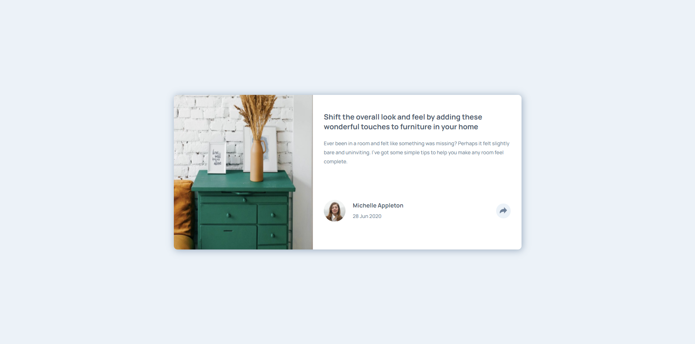

# Frontend Mentor - Article preview component solution

This is a solution to the [Article preview component challenge on Frontend Mentor](https://www.frontendmentor.io/challenges/article-preview-component-dYBN_pYFT).

## Table of contents

- [Overview](#overview)
  - [The challenge](#the-challenge)
  - [Screenshot](#screenshot)
  - [Links](#links)
- [My process](#my-process)
  - [Built with](#built-with)
  - [What I learned](#what-i-learned)
- [Author](#author)

## Overview

Article preview challenge where if you click the share icon, the social links should pop-up.

### The challenge

Users should be able to:

- View the optimal layout for the component depending on their device's screen size
- See the social media share links when they click the share icon

### Screenshot

### Links

- Solution URL: [Github](https://github.com/rrgmon/frontendmentor-challenge-newbie-6)
- Live Site URL: [Live Site](https://rrgmon.dev/frontendmentor-challenge-newbie-6/)

## My process

As usual I started with mobile first, and once everything looked alright, I proceeded to desktop version. Here I used media queries to change the layout completely for each screen size.

### Built with

- Semantic HTML5 markup
- Javascript
- CSS custom properties
- Flexbox
- CSS Grid
- Mobile-first workflow

### What I learned

I learnt how to move the absolute divs around in all viewports.

## Author

- Website - [Rohit Regimon](https://rrgmon.dev)
- Frontend Mentor - [@rrgmon](https://www.frontendmentor.io/profile/rrgmon)
- Twitter - [@rohitregimon](https://www.twitter.com/rohitregimon)
